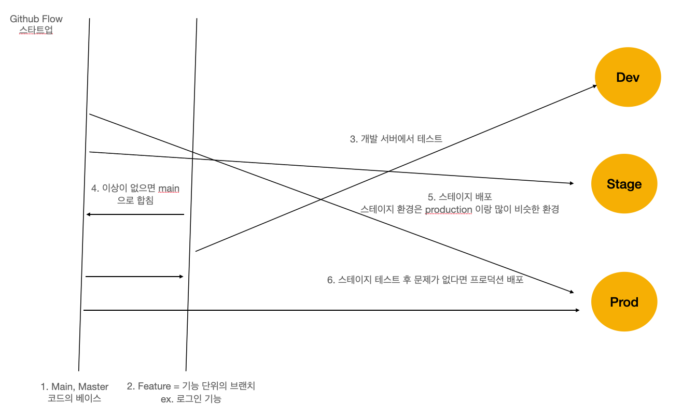
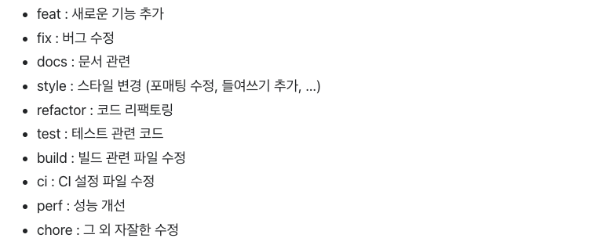

# Github Flow 연습



## 작업순서

#### 1. main 브랜치 최신화

```
$git pull origin main
```

#### 2. feature 브랜치 생성

```
$git checkout -b feature/이슈번호
```

#### 3. 작업 시작

#### 4. commit

 commit = 작업의 단위



```
현재 파일의 상태 파악
$ git status

git 한테 파일의 변화를 알려줘야한다.

$ git add .

$ git commit -m "내가 한 작업에 대한 메세지"
```

#### 5. push

push 할 때 주의점: 내가 작업한 feature 브랜치로 올려야됨
```
$ git push origin feature/이슈번호
```

